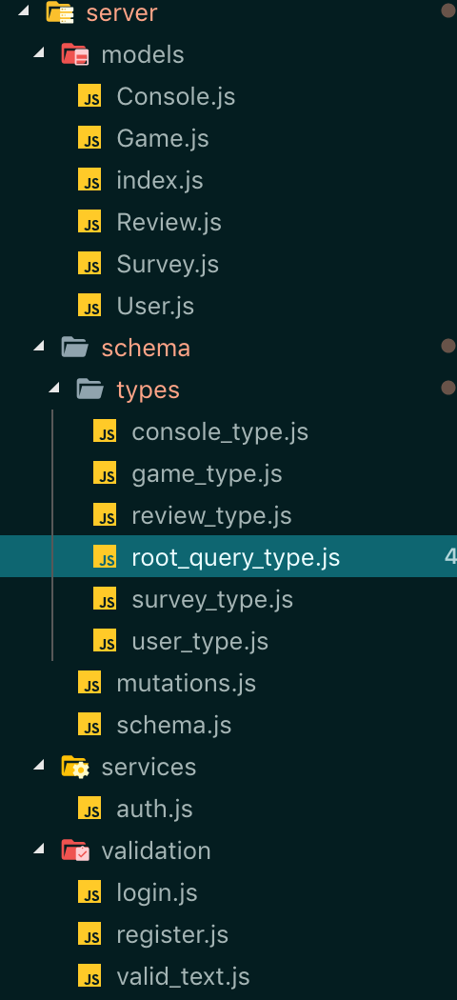

# GameHub

## Technologies:

* MongoDB
  * Database used to store data
* Express
  * JavaScript (ES6) backend API
* React
..* Frontend components built using this framework
* GraphQL
  * Complex queries more efficiently structured and performed using this state-of-the-art technology, in order to show more complex relationships in our data
* Various other middleware and packages used: 
  * Apollo GraphQL
  * Mongoose
  * .env

#

GameHub is a video games database with social media features. It is inspired by popular video game blog/content creator IGN and video game marketplace Steam. The styling and structure was heavily borrowed from that of IGN's. The major features include:

* Users can sign up for an account, sign in, and sign out
* Users can interact with games that have been uploaded to the site by an admin (more on admin later), meaning...
  * Users can leave reviews on games, either liking or disliking the game (they can dislike or like the game independently or leave a short description of their opinion of the game as well)
  * Users can view a photo of the game
  * Users can watch the trailer for the game
* Reviews left by user affect the games _GameHub Rating_, which, in turn, affect where the game is ranked, categorized by game console
* Users can view the top 3 games for a console, as well as any upcoming games on _Console Home Page_, as well as vidoes related to the console
* When a user goes to the _Game Show Page_, they can see other players reviews, the _GameHub Rating_ for the game, which is updated live when they leave their review with a CSS animation
* Admins can create new games when signed in under their admin account, as well as participate in all other basic user functionality

## Future Developments Coming Soon: 
* Uploading your own profile/avatar image
** These photos will be hosted on AWS
* Allowing pictures and videos to be uploaded to AWS instead of posting links to images and videos on external sources

## Featured Features
* The site has a fairly complex backend, tacking advantage of the team's deep knowledge of GraphQL. We individually wrote many types, models, and mutations. Below is a snapshot of the backend file structure. The most unwieldly large file is the mutations file, where all the mutations for the app can be found.



* The site utilizes CSS animation (a gif of the animation can be seen below), the animation utilizes strokes which are animated upon load of the page. 


* The was accomplished with the following code:

```javascript
if (rating) {
 const ratingColor = function(r) {
  return 'rgb(' + (200 - 2 * Math.max(50, r)) * 2.56 + ',' + (2 * Math.max(50, r) - 100) * 2.56 + ',0)';
 };

 //Creates an array of small strokes to simulate a gradient for rating colors
 const colorIndicators = [...Array(100)].map((_, i) => (
  <path
   key={i}
   d={describeArc({
    centerX: 50,
    centerY: 50,
    radius: 33,
    startAngle: 180 * (i / 100),
    endAngle: 180 * (i / 100) + 2
   })}
   fill="none"
   stroke={ratingColor(i)}
   strokeWidth={25}
   style={{ animationDelay: `${0.01 * i}s` }}
   className="fade-in"
  />
 ));

 //Creates an array of progressively larger overlapping strokes in order to animate rating growth
 const ratingStrokes = [...Array(rating)].map((_, i) => (
  <path
   key={i}
   d={describeArc({
    centerX: 50,
    centerY: 50,
    radius: 37,
    startAngle: 0,
    endAngle: 180 * (i / 100) + 2
   })}
   fill="none"
   stroke={ratingColor(i)}
   strokeWidth={25}
   style={{ animationDelay: `${0.01 * i}s` }}
   className="fade-in"
  />
 ));
 return (
  <div className="rating-meter">
   <svg viewBox="0 0 100 50" className="rating-meter-viewBox">
    {colorIndicators}
    <path
     d={describeArc({
      centerX: 50,
      centerY: 50,
      radius: 37,
      startAngle: 0,
      endAngle: 180
     })}
     fill="none"
     stroke="white"
     strokeWidth={25}
    />
    {ratingStrokes}
   </svg>
   <p className="rating-meter-value" style={{ color: ratingColor(rating) }}>
    {rating}
   </p>
  </div>
 );
} 
```
